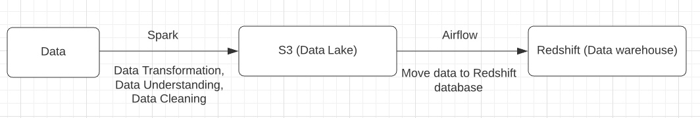
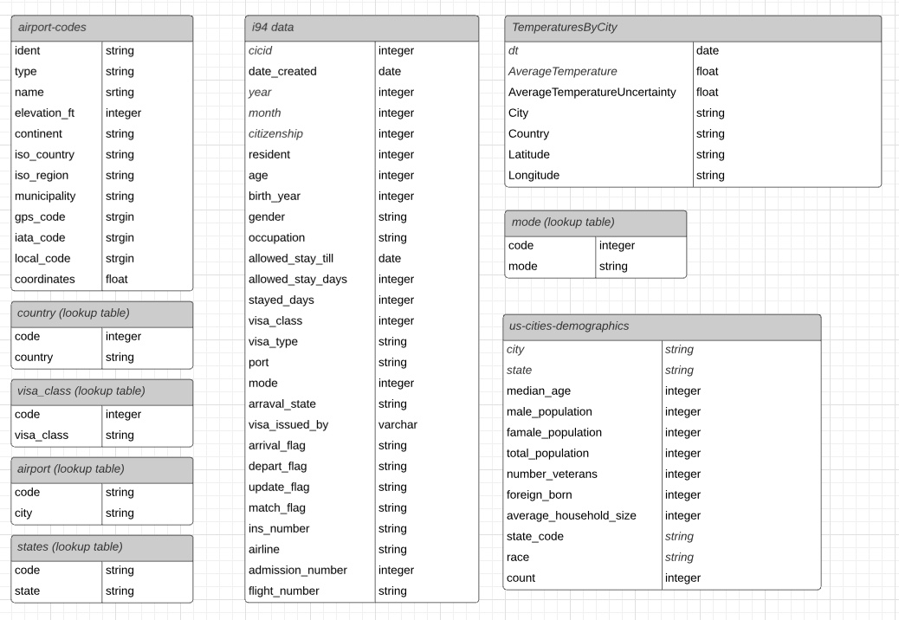
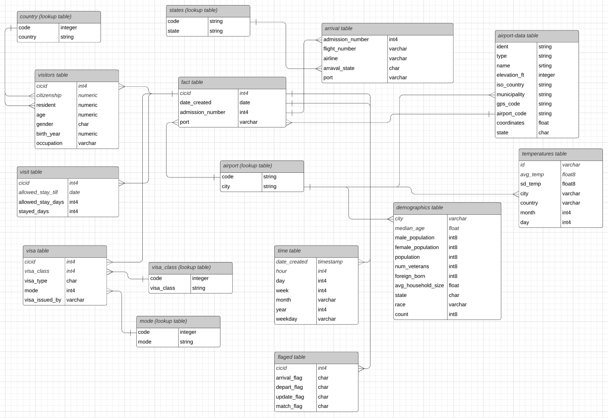
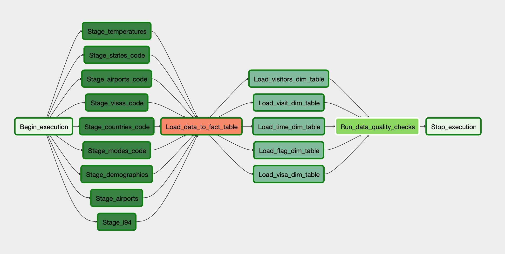
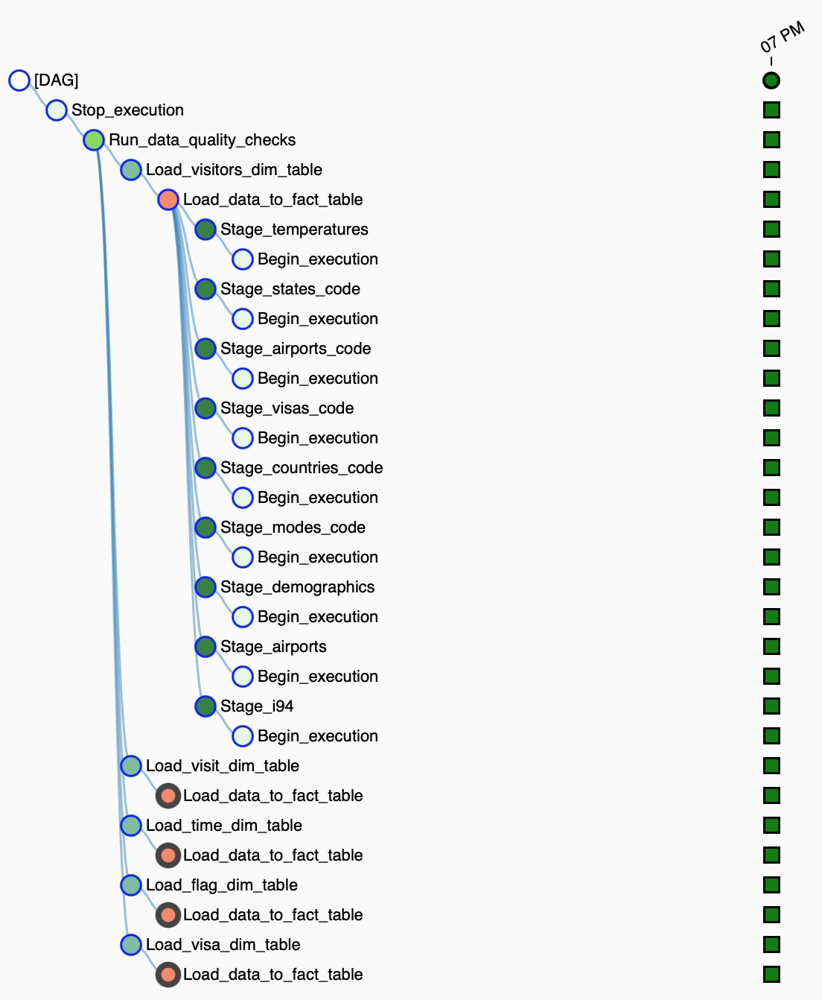

# Data Engineering Capstone Project

## Project Summary

The purpose of this project is an attempt to combine technologies learned throughout the Udacity Data Engineering program. The project encompasses four datasets. The main dataset includes data on immigration to the United States, and supplementary datasets include data on airport codes, U.S. city demographics, and temperature data.

## Scope the Project and Gather Data

### Scope

This a capstone project and it's a part of the Udacity Data Engineering Nanodegree program. This project mimics a real-life situation when you need to analyze, clean, save the data into a columnar file format and load the data to a data lake on S3 using Spark. Create an Airflow pipeline to load the data to the Redshift database for further analytical purposes. You can see the process below.

### Describe and Gather Data

The project contains four files that were gathered and provided by Udacity.
I94 Immigration Data comes from the US National Tourism and Trade Office. A data dictionary is included in the workspace. There is a link to the original dataset https://travel.trade.gov/research/reports/i94/historical/2016.html. A sample dataset was along provided in the workspace (immigration_data_sample.csv). The data dictionary can be found in I94_SAS_Labels_Descriptions.SAS file.

### I94 Data Dictionary

* cicid - float64 - ID that uniquely identify one record in the dataset
* i94yr - float64 - 4 digit year
* i94mon- float64 - Numeric month
* i94cit - float64 - 3 digit code of source city for immigration (Born country)
* i94res - float64 - 3 digit code of source country for immigration (Residence country)
* i94port - object - Port addmitted through
* arrdate - float64 - Arrival date in the USA
* i94mode - float64 - Mode of transportation (1 = Air; 2 = Sea; 3 = Land; 9 = Not reported)
* i94addr - object - State of arrival
* depdate -float64 - Departure date
* i94bir - float64 - Age of Respondent in Years
* i94visa - float64 - Visa codes collapsed into three categories: (1 = Business; 2 = Pleasure; 3 = Student)
* count - float64 - Used for summary statistics
* dtadfile - object - Character Date Field
* visapost - object - Department of State where where Visa was issued
* occup - object - Occupation that will be performed in U.S.
* entdepa - object - Arrival Flag. Whether admitted or paroled into the US
* entdepd - object - Departure Flag. Whether departed, lost visa, or deceased
* entdepu - object - Update Flag. Update of visa, either apprehended, overstayed, or updated to PR
* matflag - object - Match flag
* biryear - float64 - 4 digit year of birth
* dtaddto - object - Character date field to when admitted in the US
* gender - object - Gender
* insnum - object - INS number
* airline - object - Airline used to arrive in U.S.
* admnum - float64 - Admission number, should be unique and not nullable
* fltno - object - Flight number of Airline used to arrive in U.S.
* visatype - object - Class of admission legally admitting the non-immigrant to temporarily stay in U.S.

World Temperature Data comes from Kaggle. Further details about the dataset can be found here: https://www.kaggle.com/berkeleyearth/climate-change-earth-surface-temperature-data.

### World Temperature Data Dictionary

* dt - Date in format YYYY-MM-DD
* AverageTemperature - Average temperature of the city in a given date
* AverageTemperatureUncertainty - Standard Deviation of the avg. temperature
* City
* Country
* Latitude
* Longitude

The U.S. City Demographic Data comes from OpenSoft. Further details about the dataset can be found here: https://public.opendatasoft.com/explore/dataset/us-cities-demographics/export/.

### Demographic Data Dictionary

* City - Name of the city
* State - US state of the city
* Median Age - The median of the age of the population
* Male Population - Number of the male population
* Female Population - Number of the female population
* Total Population - Number of the total population
* Number of Veterans - Number of veterans living in the city
* Foreign-born - Number of residents of the city that were not born in the city
* Average Household Size - Average size of the houses in the city
* State Code - Code of the state of the city
* Race - Race class
* Count - Number of individual of each race

Airport Date is a simple table of airport codes and corresponding cities. The data can be found here: https://datahub.io/core/airport-codes#data.

### Airport Data Dictionary

* ident - Unique identifier
* type - Type of the airport
* name - Airport Name
* elevation_ft - Altitude of the airport
* continent - Continent
* iso_country -ISO code of the country of the airport
* iso_region - ISO code for the region of the airport
* municipality - City where the airport is located
* gps_code - GPS code of the airport
* iata_code - IATA code of the airport
* local_code - Local code of the airport
* coordinates - GPS coordinates of the airport

### Define the Data Model

### Conceptual Data Model
Star schema will be used for this project. The schemas will contain a fact table with multiple dimensional tables. Below you can see current tables.

And the following Data Model is considered.

### Data Model

### Mapping Out Data Pipelines

The data pipeline consists of 15 tables and allows to provide analytical information for the immigration department based on multiple parameters, like temperature on arrival city, the volume of visitors by the month of the year and many other insights that can help with planing the workload. The pipeline contains the following steps. 

- Read I94 SAS files to spark data frame, rename columns, remove 
- Rename columns to a more readable format
- Remove null values from dtadfile since we need to use it as a primary key
- Convert dtaddto and date_created to to_date format
- Create a new column stayed_days to define the number of days each visitor stayed
- Create a day column that can be used along month and city to map the temperature table 
- Create the airport table where iata_code is not null and iso_country is US
- For airport table convert iso_region into new column called state
- Create the temperature table where Country is United States and year is 2012
- Create the demographic table and rename columns to easy-read names.
- Define two functions to create five mapping tables for I94 data. 
- Save all tables in parquet format and load them to data lake S3.

### ETL

### Data Quality Checks

Data quality checks were run by the Airflow pipeline during the process of uploading data to the Redshift database.

### How to Run the Project

1. Update dwh.cfg file with your AWS ACCESS KEY and AWS SECRET ACCESS KEY.

2. Create an EMR cluster, upload data and run etl.py to load all datasets in AWS S3 and save them in parquet format.

3. Create a Redshift cluster, it should be located in the same region as S3 bucket. Make sure it publicly available and your IP is whitelisted in the security group.

4. Install Airflow. There is a detailed guide on how to install it with docker (https://towardsdatascience.com/getting-started-with-airflow-using-docker-cd8b44dbff98)

5. Upload airflow folder into your Airflow instance

6. Create and config Airflow connections. Create an AWS connection with your AWS credentials. Next, create another connection for the Redshift cluster using the Postgress connector. 

7. Run dag_tables_capstone DAG to create all necessary table on Redshift

8. Run dag_main_capstone DAG to load data and run data quality checks

#### Note: Python 3 was used for all scripts
