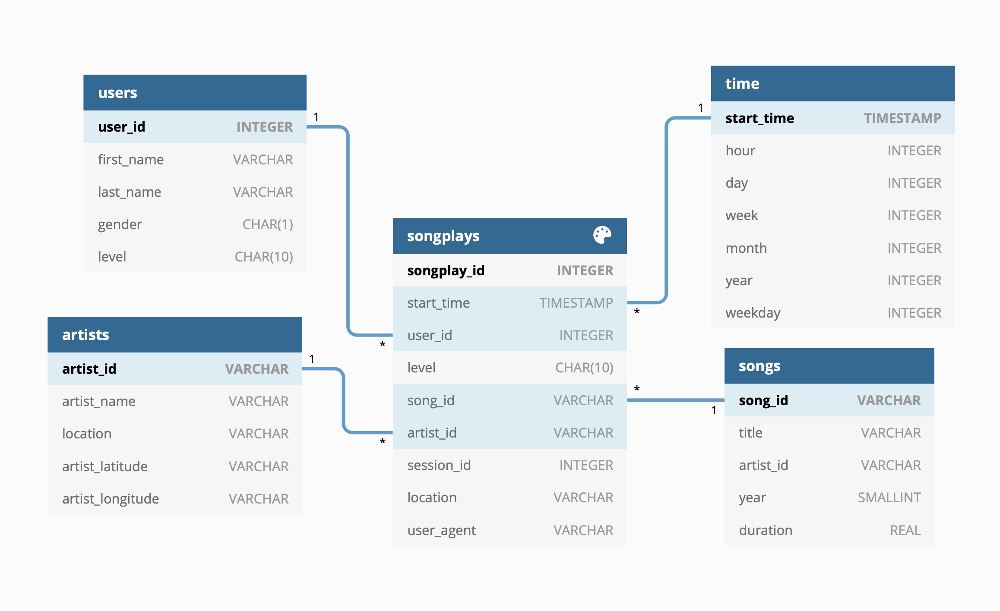
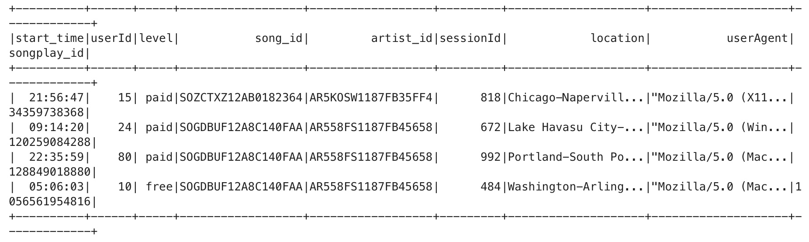
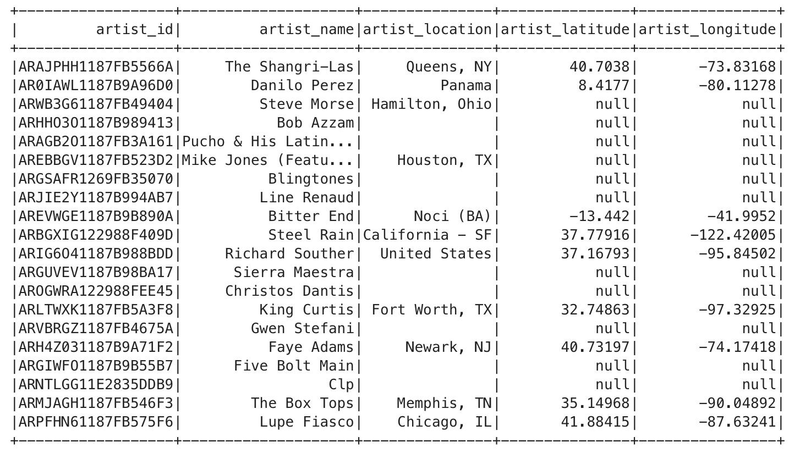
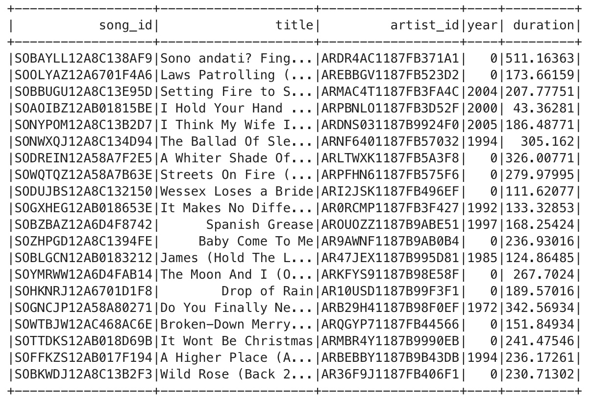
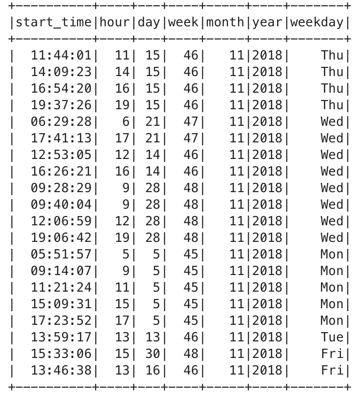
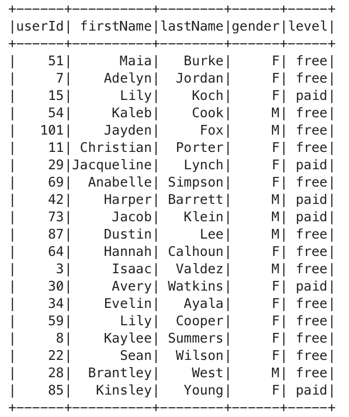

# Project: Data Lake using S3 and EMR cluster with Saprk

This project was offered as part of Udacity's Data Engineering Nanodegree program.

## Introduction

A music streaming startup, Sparkify, has grown their user base and song database even more and want to move their data warehouse to a data lake. Their data resides in S3, in a directory of JSON logs on user activity on the app, as well as a directory with JSON metadata on the songs in their app.

I have tasked with building an ETL pipeline that extracts their data from S3, processes them using Spark, and loads the data back into S3 as a set of dimensional tables. This will allow their analytics team to continue finding insights in what songs their users are listening to.


## Project Description

In this project, I applied what I've learned on Spark and data lakes to build an ETL pipeline for a data lake hosted on S3. To complete the project, I loaded data from S3, process the data into analytics tables using Spark, and load them back into S3. I deploied this Spark process on a cluster EMR using AWS.

## Project Datasets

I was given two datasets that reside in S3. Here are the S3 links for each:

- Song data: s3://udacity-dend/song_data
- Log data: s3://udacity-dend/log_data

### Song Dataset

The first dataset is a subset of real data from the Million Song Dataset. Each file is in JSON format and contains metadata about a song and the artist of that song. The files are partitioned by the first three letters of each song's track ID. For example, here are filepaths to two files in this dataset.
```
song_data/A/B/C/TRABCEI128F424C983.json
song_data/A/A/B/TRAABJL12903CDCF1A.json
```

And below is an example of what a single song file, TRAABJL12903CDCF1A.json, looks like.

```{"num_songs": 1, "artist_id": "ARJIE2Y1187B994AB7", "artist_latitude": null, "artist_longitude": null, "artist_location": "", "artist_name": "Line Renaud", "song_id": "SOUPIRU12A6D4FA1E1", "title": "Der Kleine Dompfaff", "duration": 152.92036, "year": 0}```

### Log Dataset

The second dataset consists of log files in JSON format generated by this event simulator based on the songs in the dataset above. These simulate app activity logs from an imaginary music streaming app based on configuration settings.

The log files in the dataset you'll be working with are partitioned by year and month. For example, here are filepaths to two files in this dataset.
```
log_data/2018/11/2018-11-12-events.json
log_data/2018/11/2018-11-13-events.json
```

## Schema for Song Play Analysis

Using the song and event data, I created a star schema optimized for queries on song play analysis. This includes the following tables.

#### Fact Table

1. songplays - records in event data associated with song plays i.e. records with page NextSong

**songplay_id, start_time, user_id, level, song_id, artist_id, session_id, location, user_agent**

#### Dimension Tables

2. users - users in the app

**user_id, first_name, last_name, gender, level**

3. songs - songs in music database

**song_id, title, artist_id, year, duration**

4. artists - artists in music database

**artist_id, name, location, lattitude, longitude**

5. time - timestamps of records in songplays broken down into specific units

**start_time, hour, day, week, month, year, weekday**

### Dimension Tables




## Project Template

The project template includes four files:

**etl.py** reads data from S3, processes that data using Spark, and writes them back to S3 using Udacity workspace. 

**etl-emr.py** reads data from S3, processes that data using Spark, save the data to HDFS, and writes them back to S3.

**dl.cfg** contains your AWS credentials

**README.md** provides a project description and discussion on the process and decisions for this ETL pipeline.

**etl_emr.ipyb** and **etl_ prototyping.ipynb** Jupyter notebooks where I prototyped ETL pipelines.   

## How to Run the Project


1. Create AWS EMR cluster make sure it comes with s3-dist-cp.

2. Create notebook and connect it to your EMR cluster. Open JupyterLab and upload etl-emr.py. Open new pyspark notebook. 

3. Update ```['AWS_ACCESS_KEY_ID']``` and ```['AWS_SECRET_ACCESS_KEY']``` with your AWS ACCESS KEY and AWS SECRET ACCESS KEY.

4. Ensure that output_data variable points to your S3 bucket.

5. Open new pyspark notebook and run following command ```! python etl-emr.py```

### ETL Pipeline

I faced a few problems while working on this project. The workspace that Udacity provided has many limitations. Running Spark jobs in the Udacity workspace was taking a lot of time and often the spark session was getting timeouts. My initial process was following - copy files from S3, create tables, save them into parquet formats and upload them to another S3 bucket. As a result, I set up my own EMR cluster and used the following steps to speed up the process significantly. Copy files from S3 to EMR cluster, process files using Spark, create parquet files and save them into HDFS, use s3-dist-cp to copy files from HDFS to another S3. This workflow significantly improved processing time. 

All tables were saved using parquet format and uploaded to S3.

The follwing tables were created:

**songplays_table** (partitioned by year and month)



**artists_table**



**songs_table** (partitioned by year and artist_id)



**time_table** (partitioned by year and month)



**users_table** (partitioned by gender and level)



### Some Examples of Analytical Queries

Breakdown by account level and gender

```sql
users_table = spark.sql("""
    SELECT gender, level, COUNT(*) AS users
    FROM users_table
    GROUP BY gender, level
""")
users_table.show()
```

| gender  | level    | users  |
| ------- |:--------:| ------:|
| M       | free     |   636  |
| F       | free     |   593  |
| F       | paid     |   4284 |
| M       | paid     |   1295 |


App activities by hour

```sql
time_table = spark.sql("""
    SELECT hour, COUNT(*) AS sessions
    FROM time_table
    GROUP BY hour
    ORDER BY hour
""")
time_table.show(24)
```

| hour    |sessions | 
| ------- |--------:| 
| 0       | 155     |  
| 1       | 154     |   
| 2       | 117     |   
| 3       | 109     | 
| 4       | 135     |  
| 5       | 162     |  
| 6       | 183     |  
| 7       | 179     |  
| 8       | 207     |  
| 9       | 270     |  
| 10      | 312     |  
| 11      | 336     |  
| 12      | 308     |  
| 13      | 324     |  
| 14      | 430     |  
| 15      | 477     |  
| 16      | 541     |
| 17      | 493     |
| 18      | 497     |
| 19      | 366     |
| 20      | 360     |
| 21      | 280     |
| 22      | 217     |
| 23      | 201     |


**Note: Python 3 was used for all scripts**


