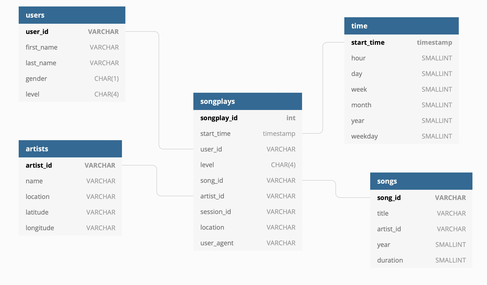

<h1>Projet - Data Modeling with Postgres "Sparkify"</h1>
    
<h2>Introduction</h2>
    

A startup called Sparkify wanted to analyze the data they've been collecting on songs and user activity on their new music streaming app. The analytics team is particularly interested in understanding what songs users are listening to. Currently, they don't have an easy way to query their data, which resides in a directory of JSON logs on user activity on the app, as well as a directory with JSON metadata on the songs in their app.

    

The main objective of this project was the creation of a Postgres database with tables designed to optimize queries on song play analysis. The role was to create a database schema and ETL pipeline for this analysis.

    
<h2>Project Description</h2>
    

In this project, I applied what I've learned on data modelling with Postgres and build an ETL pipeline using Python. For this project, I needed to define fact and dimension tables for a star schema for a particular analytic focus, and write an ETL pipeline that transfers data from files in two local directories into tables in Postgres using Python and SQL.

<h2>Project Summary</h2>

I was able to successfully create the database, necessary tables and transfer provided data generated by the app. The project contains six files including README.md. This project is ready to be deployed on the client's end and provides all necessary tables for the analytical team.

<h2>How to Run Project</h2>

You need to run only two files to deploy the database and load data. The first step is to run <strong>create_table.py</strong> file in your enviroment (please make sure that all dependansies are installed). To run the script use the following line in your CLI <strong>python3 create_table.py</strong>. The second step is to run the ETL pipeline <strong>etl.py</strong> file. This script extracts, applies transformations and loads data to tables created by <strong>create_table.py</strong>. To run the script use following command <strong>python3 etl.py</strong>.

    
<h2>File Descriptions</h2>

<ol>
<li><strong>create_table.py</strong> - this script creates the database and all required tables and can be used to recreate the database with empty tables if necessary.</li>
<li><strong>etl.py</strong> - this script loads data to tables</li>
<li><strong>sql_queries.py</strong> - this script is used by create_table.py script and create/drop tables and necessary schema for each table</li>
<li><strong>etl.ipynb</strong> - this jupyter notebook describes all the steps and logic of the ELT pipeline.</li>
<li><strong>test.ipynb</strong> - this jupyter notebook is used to test if data load and database creation were successful</li>
</ol>

<h2>Database Schema and ELT Pipeline</h2>

Original data comes from two sources, first, one is song data and contains the following attributes: artist_id, artist_latitude, artist_location, artist_longitude, artist_name, duration, num_songs, song_id, title, year and the second one is log data generated by the app users. This data contains the following attributes: artist, auth, firstName, gender, itemInSession, lastName, length, level, location, method, page, registration, sessionId, song, status, ts, userAgent, userId.

To satisfy business and analytical requirements I utilized a star schema for the database design, the schema contains the fact table (songplay) and four dimension tables (songs, artists, time, users).

   

For this project the following attributes were used 
song_id, title, artist_id, year, duration, name, location, latitude, longitude, level,session_id, user_agent, start_time, first_name,last_name, gender)    

start_time were used to create extra attributes like hour, day, week, month, year, weekday.

    
<h3>Star Schema</h3>

During the data ingestion process, numerous issues were addressed to satisfy database requirements. All duplicated data in users, songs, artists, time tables were handled with upsert function ON CONFLICT / DO NOTHING.   

