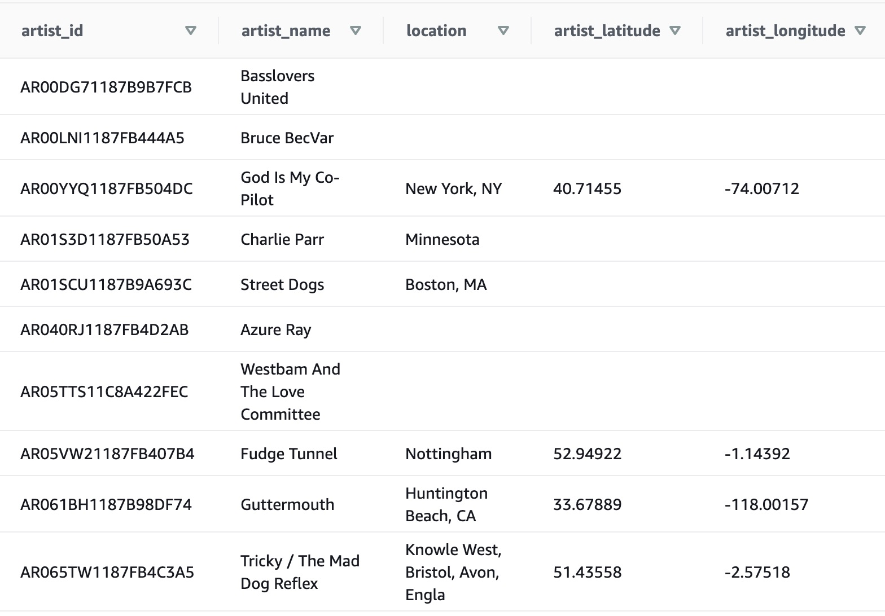

# Project: Data Warehouse with Redshift (AWS)

This project was offered as part of Udacity's Data Engineering Nanodegree program.

## Introduction

A music streaming startup, Sparkify, has grown its user base and song database and want to move their processes and data onto the cloud. Their data resides in S3, in a directory of JSON logs on user activity on the app, as well as a directory with JSON metadata on the songs in their app.

I was tasked with building an ETL pipeline that extracts their data from S3, stages them in Redshift, and transforms data into a set of dimensional tables for their analytics team to continue finding insights in what songs their users are listening to.

## Project Description

In this project, I applied what I've learned on data warehouses and AWS to build an ETL pipeline for a database hosted on Redshift. To complete the project, I loaded data from S3 to staging tables on Redshift and executed SQL statements that create the analytics tables from the staging tables.

## Project Datasets

I was given two datasets that reside in S3. Here are the S3 links for each:

- Song data: s3://udacity-dend/song_data
- Log data: s3://udacity-dend/log_data
- Log data json path: s3://udacity-dend/log_json_path.json

### Song Dataset

The first dataset is a subset of real data from the Million Song Dataset. Each file is in JSON format and contains metadata about a song and the artist of that song. The files are partitioned by the first three letters of each song's track ID. For example, here are filepaths to two files in this dataset.
```
song_data/A/B/C/TRABCEI128F424C983.json
song_data/A/A/B/TRAABJL12903CDCF1A.json
```

And below is an example of what a single song file, TRAABJL12903CDCF1A.json, looks like.

```{"num_songs": 1, "artist_id": "ARJIE2Y1187B994AB7", "artist_latitude": null, "artist_longitude": null, "artist_location": "", "artist_name": "Line Renaud", "song_id": "SOUPIRU12A6D4FA1E1", "title": "Der Kleine Dompfaff", "duration": 152.92036, "year": 0}```

### Log Dataset

The second dataset consists of log files in JSON format generated by this event simulator based on the songs in the dataset above. These simulate app activity logs from an imaginary music streaming app based on configuration settings.

The log files in the dataset you'll be working with are partitioned by year and month. For example, here are filepaths to two files in this dataset.
```
log_data/2018/11/2018-11-12-events.json
log_data/2018/11/2018-11-13-events.json
```

## Schema for Song Play Analysis

Using the song and event data, I created a star schema optimized for queries on song play analysis. This includes the following tables.

#### Fact Table

1. songplays - records in event data associated with song plays i.e. records with page NextSong

**songplay_id, start_time, user_id, level, song_id, artist_id, session_id, location, user_agent**

#### Dimension Tables

2. users - users in the app

**user_id, first_name, last_name, gender, level**

3. songs - songs in music database

**song_id, title, artist_id, year, duration**

4. artists - artists in music database

**artist_id, name, location, lattitude, longitude**

5. time - timestamps of records in songplays broken down into specific units

**start_time, hour, day, week, month, year, weekday**

### Staging Tables


### Dimension Tables


Note: Redshift does not have primary or unique keys. However, I defined Primary, Foreign keys since the query optimizer uses those constraints to generate more efficient query plans, but Redshift didn't enforce them. As a result, I needed to deduplicate data using SQL subquery with DISTINCT before loading it into the Redshift tables. 

## Project Template

The project template includes four files:

**create_table.py** creates fact and dimension tables for the star schema in Redshift.

**etl.py** loads data from S3 into staging tables on Redshift and then process that data into your analytics tables on Redshift.

**sql_queries.py** defines SQL statements, which will be imported into the two other files above.

**redshift_cluster.ipynb** jupyter notebook that creates Redshift cluster programaticaly.

**README.md** provides a project description and discussion on the process and decisions for this ETL pipeline.

## How to Run the Project

1. Update **dwh.cfg** file with your IAM KEY, SECRET, create your Redshift CLUSTER, DB_NAME (database name), DB_USER (database user name), DB_PASSWORD (database password).

2. Open redshift_cluster.ipynb notebook and run all lines of code, wait till the Redshift cluster gets propagated. The last cell of the notebook will print out your DWH_ENDPOINT and DWH_ROLE_ARN. Use DWH_ENDPOINT for your HOST and DWH_ENDPOINT in the **dwh.cfg** file. Do not forget to update DWH_ROLE_ARN in the **dwh.cfg** file. 

3. Open terminal and run the create_cluster.py **(python create_cluster.py)** script of the ETL pipeline. This script connects to AWS Redshift and creates a database and necessary staging and dimension tables.

4. Next run the etl.py script **(python etl.py)**. It loads the data from S3 into staging tables on Redshift. Staging tables will be used to populate all dimension tables. When the script stops running all dimension tables will be populated with data. 

6. Log in to your AWS account, open Redshift and check whether or not all of the results of the queries match the expected results.

## Examples of Tables on Redshift Cluster

There are different ways of how you can use run analytical queries. It can be done via the command line interface, from Jupyter Notebook or directly in Reshift interface on AWS using Editor.

### Redshift Interface


### Artists Table




### Songs Table


### Time Table


### Users Table


### Songplays Table


**Note: Python 3 was used for all scripts**

